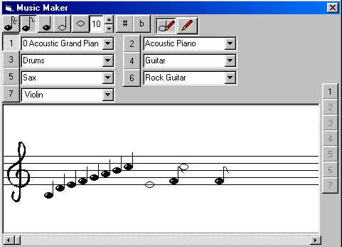



## Music Compuser \(notation interface\)

### Description

An incomplete music composer (Can't save or load songs, can't print, or replay it after you have written it)
 
### More Info
 

             |
---                |---
**Submitted On**   |2002-05-05 17:28:44
**By**             |[Lefteris Eleftheriades](https://github.com/Planet-Source-Code/PSCIndex/blob/master/ByAuthor/lefteris-eleftheriades.md)
**Level**          |Intermediate
**User Rating**    |4.6 (37 globes from 8 users)
**Compatibility**  |VB 5\.0, VB 6\.0
**Category**       |[Sound/MP3](https://github.com/Planet-Source-Code/PSCIndex/blob/master/ByCategory/sound-mp3__1-45.md)
**World**          |[Visual Basic](https://github.com/Planet-Source-Code/PSCIndex/blob/master/ByWorld/visual-basic.md)
**Archive File**   |[Music\_Comp79577552002\.zip](https://github.com/Planet-Source-Code/lefteris-eleftheriades-music-compuser-notation-interface__1-34476/archive/master.zip)

